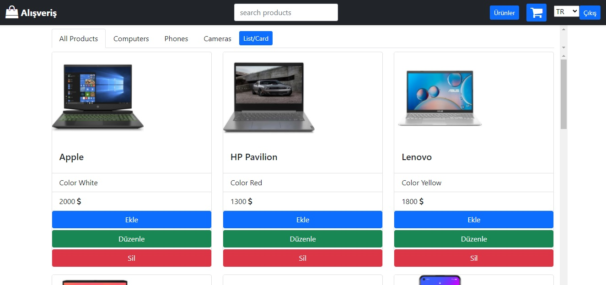

<h1 align="center">Angular-Patika - E-Commerce App)</h1>


[](https://youtu.be/MzAblpYjaUA)

<h3 align="center">Languages and Tools:</h3>
<p align="center"> <a href="https://angular.io" target="_blank" rel="noreferrer">  </a> <a href="https://getbootstrap.com" target="_blank" rel="noreferrer">  </a> <a href="https://www.w3schools.com/css/" target="_blank" rel="noreferrer">  </a> <a href="https://www.w3.org/html/" target="_blank" rel="noreferrer">  </a> <a href="https://developer.mozilla.org/en-US/docs/Web/JavaScript" target="_blank" rel="noreferrer">  </a> <a href="https://nodejs.org" target="_blank" rel="noreferrer">  </a> <a href="https://www.typescriptlang.org/" target="_blank" rel="noreferrer">  </a>


## Contents:
 - [Categories](#categories)
      - [Video](#video)
      - [About](#about-project)
      - [Used Packages And Modules](#used-packages-and-modules)
      - [Getting Started](#getting-started)
      - [Server](#server)
      - [Prerequisites](#prerequisites)
      - [Installation](#installation)
      - [Contact](#contact)

## Video


## About Project
 This Project is Patika-Orion Innovation Turkey Angular Bootcamp assignment. I try to make myself imagine.

## Used Packages And Modules

- AppRoutingModule
- HttpClientModule
- FormsModule
- ReactiveFormsModule
- Font Awesome
- Bootstrap 5
- Google Fonts
- AuthGuard

## Getting Started

:rocket: Run `npm i or npm install` to install all packages then You should use `ng serve --o`.

## Server

 :electric_plug: Product server is online wiith Heroku but for user you need to run json-server.

## Prerequisites

- npm
- Angular 13
- Bootstrap 5
- Vs Code

## Installation
1. Clone the repo
```sh
git clone https://github.com/firatmikyaz/graduationProject.git
```
2. Install NPM packages
```sh
npm install
```
3. Run Angular Project
```sh
ng serve --o
```
## Credit


## license

Distributed under the MIT License. See `LICENSE` for more information.

## Contact

Your Name - [Linkedin](https://tr.linkedin.com/in/firatmikyaz) - firat.mikyaz.tr@gmail.com

Project Link:  https://github.com/firatmikyaz/graduationProject.git


# Shopping

This project was generated with [Angular CLI](https://github.com/angular/angular-cli) version 13.2.5.

## Development server

Run `ng serve` for a dev server. Navigate to `http://localhost:4200/`. The app will automatically reload if you change any of the source files.

## Code scaffolding

Run `ng generate component component-name` to generate a new component. You can also use `ng generate directive|pipe|service|class|guard|interface|enum|module`.

## Build

Run `ng build` to build the project. The build artifacts will be stored in the `dist/` directory.

## Running unit tests

Run `ng test` to execute the unit tests via [Karma](https://karma-runner.github.io).

## Running end-to-end tests

Run `ng e2e` to execute the end-to-end tests via a platform of your choice. To use this command, you need to first add a package that implements end-to-end testing capabilities.

## Further help

To get more help on the Angular CLI use `ng help` or go check out the [Angular CLI Overview and Command Reference](https://angular.io/cli) page.


<h2 align="center">Requirements</h2>
Orion Innovation Angular/Frontend Bootcamp Bitirme Projesi
 
 //Ürün satışının, kullanıcı kaydının ve girişinin yapıldığı, yeni ürünlerin eklenip,
güncellenibildiği ve silinebildiği bir web uygulaması geliştirilecek.
Fonksiyoneliteler:
 //Uygulama responsive tasarımı desteklemeli, mobil ve bilgisayar ekranlarına uyumlu
çalışmalı (ui component frameworkleri, libraryleri kullanılabilir)
 //Kullanıcılar uygulamaya üye olabilmeli ve giriş yapabilmeli (json dosyasına kayıt
oluşturulup, json dosyasından doğrulama yapılabilir, ya da ekstra bir api yazılabilir)
 //Ürün kartında bulunması gerekenler; ürünlerin resmi, adı, açıklaması ve fiyatı
 //Ürün listesi ana sayfada gösterilmeli, kullanıcılar isterlerse ürünlerin detayına,
ürünlerin üzerine tıklayarak bakabilmeli
 //Ürünlerin detay sayfasında, ürünün daha büyük bir resmi ve daha detaylı bir açıklama
metni olmalı
 //Ürünlerin filtrelenmesi için; kategori seçeneği (dropdown, selector, kategorileri siz
belirlemelisiniz) ve bir arama çubuğu oluşturulmalı, anahtar kelimesinin ürün adında
geçip geçmediğine bakılmalı
 //Ürün detayına gidilirken, sayfa yönlendirilmesi (routing) yapılmalı
 //Ürünler kendinizin belirleyeceği bir json kaynak dosyasından alınmalı
 //Ürünler sepete eklenip daha sonrasında satış işlemi gerçekleştirilmeli
 //Satış işlemi için ayrı bir json dosyasına log kaydı atılması yeterli
 //Authentication ve Authorization katmanları olmalı, sistemde iki tip aktör olmalı (public
kullanıcı, site yöneticisi). Public kullanıcı ürünleri görüntüleyebilir, filtreleyebilir, sepete
ekleyebilir ve satış işlemini gerçekleştirebilir. Site yöneticisi ise yeni ürün ekleyebilir,
mevcut ürünlerin içeriklerini güncelleyebilir ve silebilir. Public kullanıcı ürünlerin
yönetildiği sayfaya erişim sağlayamamalı.
 //Ürünler kart listesi olarak görüntülenebildiği gibi, bir tabloda da görüntülenebilmeli
(kullanıcıya seçim yaptırılmalı)
 //Ürünler içeriklerine göre detaylı bir şekilde filtrelenebilmeli
 //Site yöneticisi yeni ürün ekleme ekranında, formda herhangi bir değişiklik yaptığı
durumda, başka bir sayfaya route etmek isterse kaydedilmemiş değişiklikleriniz
bulunmaktadır tarzında bir uyarı ile karşılaşmalı ve onaylarsa route işlemi yapılmalı,
onaylamazsa aynı sayfada kalmalı
 //Authentication için kullanıcı bilgileri local storage da tutulmalı
Gereklilikler:
 //Reactive form yaklaşımı kullanılmalı
 //Form işlemlerinde validasyon yönetimi yapılmalı ve kullanıcı dostu bir uyarı mesajı
üretilmeli
 //Http istekleri için HttpClient paketi ve service katmanı kullanılmalı
 Comment kullanımına dikkat edilmeli
 TypeScript özelliklerinden type ve access modifiers kullanımına dikkat edilmeli
 //Authorization için anguların sunduğu guardlar kullanılmalı
 //Kullanıcı dostu, detaylı bir tasarım yapılmalı (UI/UX)
 //Http isteklerinde kullanıcıya ait bir token eklenmeli (dummy, herhangi bir değer
kullanılabilir)
Ekstralar:
 //Ürünlerin detay kısmında, ürün ile ilgili oluşturulacak dummy(sahte) yorumların ve
değerlendirmelerin görüntülenmesi
 //Component mimarisinin anlaşılır, tekrar kullanılabilecek şekilde kurgulanması
 //RxJS ve observableların doğru kullanımı
//KullanılacakTeknolojiler: Angular (13), JavaScript, TypeScript
